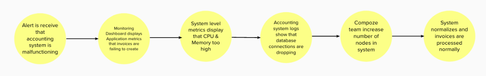
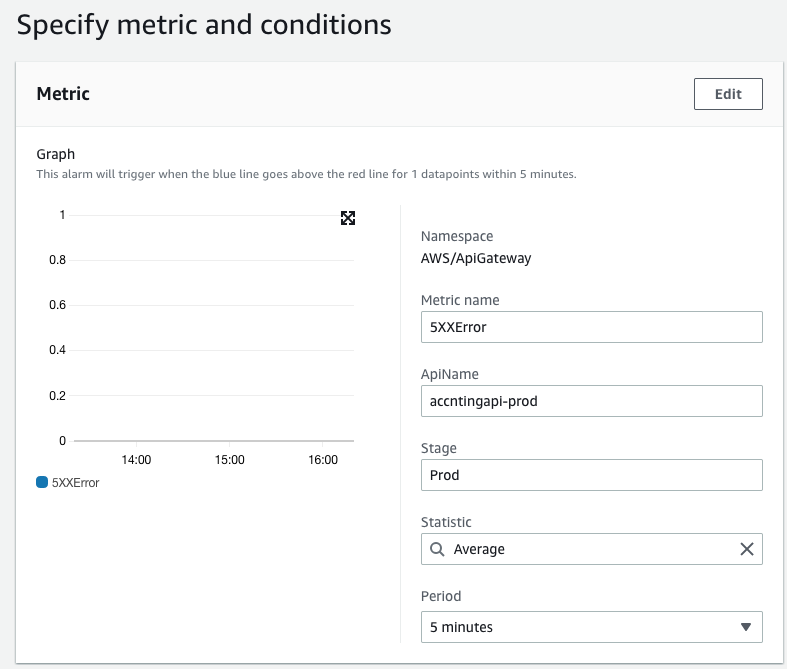
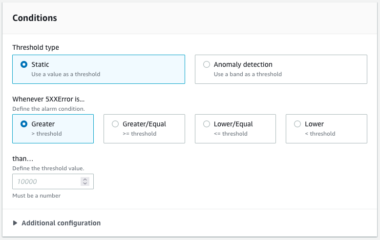

# Operations

Designing and building a series of connected services/apis is one thing, ensuring that they are running smoothly is another. Compoze's monitoring platform is built in order to ensure that everything is running smoothly, and in the event something goes wrong, that the issue is found and corrected with an emphasis on minimizing business impact. In order to do this, the Compoze Monitoring Platform works with the following areas: Logging, Tracing, Metrics & Monitoring Dashboards, and Alerting.

## Definitions

### Alerting

Alerts are the mechanisms used to notify the team that something is going wrong with the system. Common forms of alerts are sms, email, and slack. The key to good alerts is to reduce the noise, by only alerting on critical issues that must be address immediately.

### Monitoring Dashboards

Metrics & Monitoring dashboards are where the team goes to understand what part of the system is malfunctioning.

### Metrics

While the Dashboard is responsible for the display of this data, Metrics are the data that is displayed. There are two types: Application and System level metrics. An application level metric is data that represents events happening in the system. For example, number of orders processed in the last hour, or number of invoices that have failed to create. Application level metrics, in AWS, are generally [Custom Metrics](https://docs.aws.amazon.com/AmazonCloudWatch/latest/monitoring/publishingMetrics.html), meaning the developer must configure and publish them explicitly. System level metrics are low level metrics that monitor the system itself, for example, Queue depth, CPU usage, Memory usage, etc. AWS publishes these metrics by default, and therefore you can configure Alerts and Dashboards without needing to publish them explicitly. The Application level metrics tell you what part of the system is failing, while System level metrics give you insight into why that part of the system is failing

### Logging

Logging is the lowest level of operational concerns. Logging gives insight into what exactly is happening for a given part of the system.

### Tracing

Tracing is used to visualize how data is moving through the system. For example, a tracing dashboard of a flow, will show what Actions are taken after a given Trigger.

Compoze uses these operational aspects to as part of their support workflow. Below is an example of an example troubleshooting workflow for an invoicing system

## How & when to implement

## Alerts

Alerting is a delicate balance between being notified something critical needs your attention, and spamming your inbox. When notifications are sent too frequently, and about non-critical issues, it is easy to start ignoring the notifications. In that case, when a critical issue does occur, it's easy to miss.

Alerts are tightly coupled to metrics, as in, you create alerts based on a Metric and a Condition. The following areas are what you will need to configure for a Metric and its Condition

Metric:

Statistic: Examples are Sum, Average, Maximum, Minimum, etc
Period: Length of time to measure

For example, you can count the Sum of 5XX errors over a 5 minute period.

Condition:

A condition is the threshold that is crossed, which will subsequently trigger the alert. For example, you can create a condition for an alert to trigger, when the Sum of 5XX errors is greater than 15, over a 5 minute period.

Deciding on what is important enough to alert on is not an exact science, but the following questions can help guide you.

1. What is the impact to the business if this fails?
2. Is there something the team can do to address the issue immediately?

Some other things to consider:

1. Ensure alerts are actionable. Avoid alerting for strictly informational purposes; alerting fatigue from routine alerts will numb operations staff and cause them to miss or respond more slowly to true events.
2. Ensure alerts are throttled. Emitting a new alert each time an error occurs can result in an overwhelming number of alerts within a short period of time during heavy loads.
3. Ensure your alerting mechanism is at least as reliable as the system being observed. Alerting via e-mail (which may not be deemed mission-critical from an enterprise tiering perspective) is not acceptable for a core mission critical business system.
4. Remember that your monitoring solution should be less complicated than the system you are monitoring. Monitoring and Alerting systems seem prone to over-engineering, and this complexity should be scrutinized carefully.

## Metrics

A Compoze integration project has 4 main types of components.

1. Web Portal
2. HTTP API
3. Event API
4. Database

Each of these must have System level metrics configured, where as Web Portal, HTTP API, and Event API should also have Application level metrics configured. Metrics enable us to answer questions about our system such as:

1. How many errors have I encountered in the past hour?
2. How quickly am I responding to client requests?
3. How quickly is the database responding to my requests?
4. Are any of my servers running out of memory?
5. Are my CPU loads aberrantly high?
6. Is my application currently running?
7. How many requests have I processed successfully in the last hour?

Below is a detailed walkthrough of "sane" defaults for metrics.

### HTTP API

An http-based API can be neatly defined by the number of operations. An operation is defined as an HTTP Verb + a resource. For example, **POST /customer** & **GET /customers**. Each operation should have _some_ metrics defined at the Application & System level. In addition, there are system level metrics that should be present at the overall API level.

### Operation System Metrics

HTTP based APIs have the benefit of adhering the HTTP spec. This means that we can easily collect data about the overall status codes that are being produced. Sane defaults should include:

1. Number of 4XX Level Status Codes: These will give you insight into issues when downstream clients are calling the operation incorrectly
2. Number of 5XX Level Status Codes: These will give you insight into issues with the operation itself is failing
3. Number of 2XX Level Status Codes: These will give you insight into the rate at which your API is being called
4. 90, 95, & 99 percentile of response time: These will give you insight into the overall performance of your api

### Operation Application Metrics

Application metrics are, as the name implies, depending on the operation and it's context within the overall application. For a given operation, it is somewhat context depend on whether or not you need to publish them. There are some rules of thumb you can use.

GET operations, generally, are for retrieval of data. If a GET operation follows that convention, a system level metric (such as number of 2XX response codes) is often good enough to be able to ask the question "how many customer lookups happen in the last 10 minutes".

POST operations, generally, are more transactional in nature. Let's take an example, where, a POST operation needs to check if a customer exists, if it does not create it, and then create an invoice. In this situation, a 2XX or 5XX response code only tells us that the overall transaction succeeded or failed. However, how do we know whether it was the customer creation that failed, or the creation of an invoice? In this case, we would recommend the following custom metrics:

Succuss:

1. Created customer
2. Created invoice

With these metrics, we will be able to know exactly how many operations resulted in creation of customers.

Failure:

1. Create customer failed
2. Create invocie failed.

With these metrics in place, we can be sure we know exactly what caused the failure of the operation.

### Event API

An event-based API, much like an HTTP-based API, can be defined by operations. There are two types of event-based APIs, a publisher (trigger) & a receiver (action). A publisher may be trigger either from a WebHook or via Polling, while a receiver is API that listens to a queue. An event can be broken down into an event type and payload (body). An event type describes what a payload given represents. For example, take the concept of an Order. An order may have multiple Triggers, each with its own unique event type, such as New Order, Canceled Order. The event payload would contain the details of the order (things like price, date sold, items, etc) and the Event Type would describe what happened (a new order, a canceled order, etc)

### Event Publisher System Level Metrics

Event system level metrics for a publisher depend on what triggers the act of publishing. For a WebHook, since it is HTTP based, you can leverage the same 2XX, 4XX, & 5XX status codes. For polling based publishers, you may need to rely on Application metrics. For both types, however, you can use the Queues metrics to determine the number of messages being published.

### Event Receiver System Level Metrics

Event receive system level metrics are generally derived from the queue that the receiver is consuming from. Since we want to build fault tolerant systems, each queue will have a dead-letter-queue where failures are placed. Some sane defaults include:

Main Queue:

ApproximateAgeOfOldestMessage: This will tell you how long it's taking to "clear the queue". This can be viewed as the time it from message publish to processing
NumberOfMessagesReceived: This will tell you the volume of messages coming through the queue

Dead Letter Queue:
ApproximateAgeOfOldestMessage: This will tell you how long the oldest message that failed as been sitting. A high number means that we are not responding to issues in a timely manner, or we need to cleanup the queue
ApproximateNumberOfMessagesVisible: This will tell you approximately how many messages have failed, meaning the number of integrations that have failed

### Event Application Level Metrics

Application metrics are, as always, dependent on the context of the application. When building a publisher, or receiver, a good way to determine what metrics you should publish is "what do I want to be informed of when something goes wrong" and "what data do I want to see to know the system is functioning properly". In our accounting example, number of failed invoices & number of customer created, are two metrics that seem to be important to know about.

### Database

Database metrics are always system level metrics. With a database, the main areas we care about are performance. Therefore, build your dashboards focusing on metrics that will affect performance. Some good defaults are:

1. Network throughput

2. Client connections

3. I/O for read, write, or metadata operations

4. Burst credit balances for your DB instances

## Logging

Logging gives you a view of what has happened in the system. Without logging information, you are generally blind to problems within your applicaiton, and severly limited in your ability to debug and resolve problematic behavior. Logging is a careful balance among a few different considerations:

1. The amount of information you need to locate and troubleshoot problems
2. The sensitivity of some information (such as payload information) that passes through your application
3. The cost of storing large amounts of log information
4. The ratio of noise to signal you need to wade through to find meaningful insights within the logs

To help balance the above considerations, here are recommended best practices:

1. Use your framework's support of different levels of log severity, such as TRACE, DEBUG, INFO, WARN, and ERROR, to facilitate log configuration and filtering
2. Log entry/exit points and key waypoints at an appropriate log severity level, such as TRACE or DEBUG.
3. Avoid logging payload contents in bulk. In cases where some amount of payload logging is necessary for forensics, consider which elements are truly necessary and which elements are sensitive and should be masked or otherwise protected.
4. Ensure that your framework, or your log statements, provide you enough information to follow the thread of execution of a particular flow even if it is interleaved with output from other threads of execution.
5. When dealing with exceptions, ensure that you log enough information to debug and understand the problem that has occured.
6. Be sure to log your exceptions at an appropriate severity level, such as ERROR (or in some cases WARN -- for example when something has failed but is being retried).
